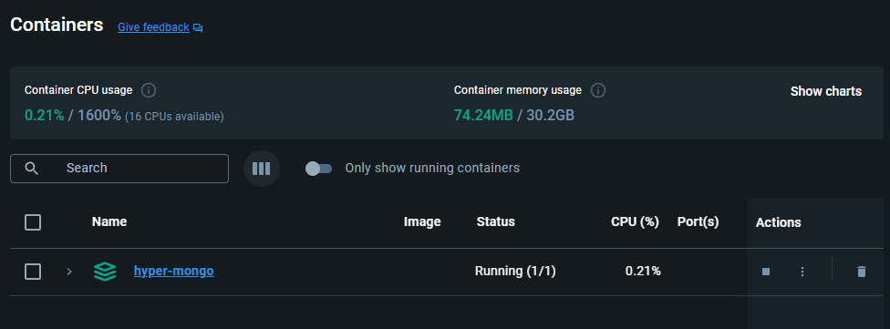
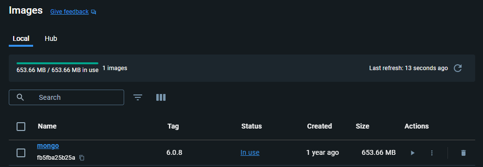
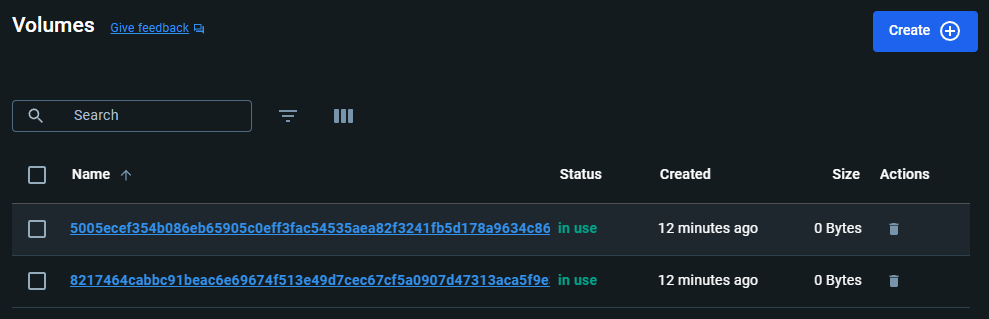
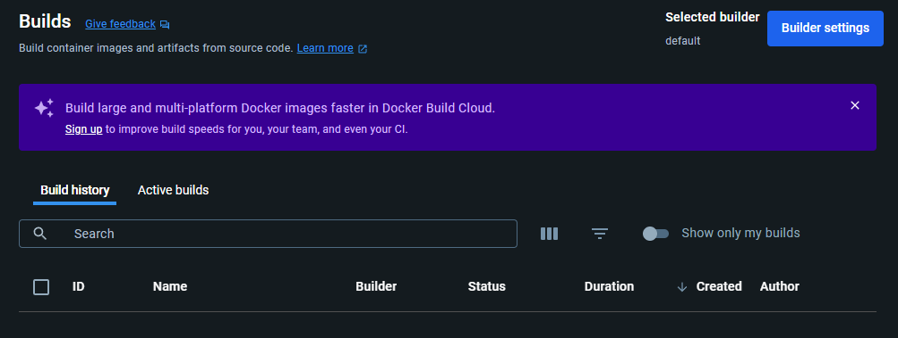
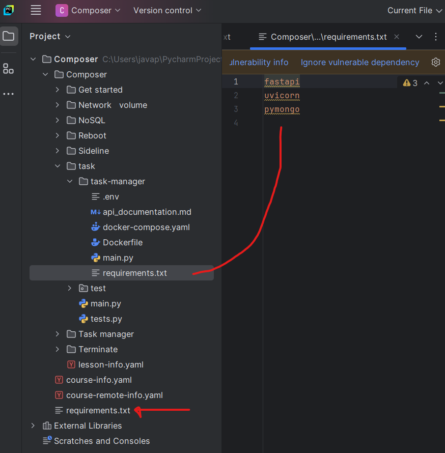
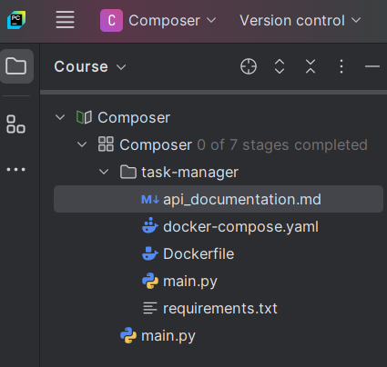
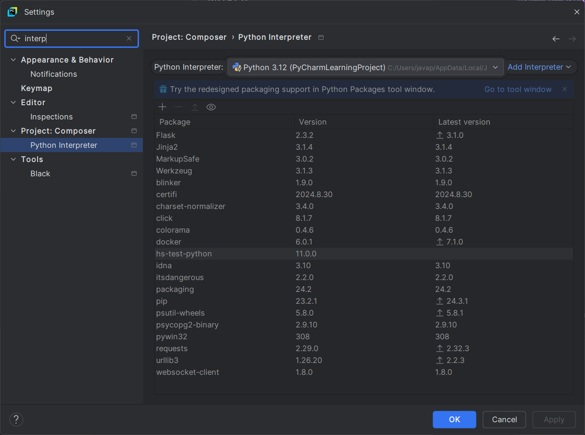

# stage-1-nosql | [readme](../readme.md)

## [Stage 1/7:NoSQL](https://hyperskill.org/projects/374/stages/2231/implement)

### NoSQL

### Description
To incorporate MongoDB as the storage for this project, create the _docker-compose.yaml_ file that launches the MongoDB service using the official [Mongo image](https://hub.docker.com/_/mongo).

> Please navigate and work in the _task-manager_ directory for upcoming tasks. The Docker files, the primary application, and the API documentation are there. You need to run stage-specific commands inside that directory.

### Objectives
* In the _docker-compose.yaml_ file, define the file syntax version as `3.1`;
* Define one service with the attributes below:
    * Define the service with the `mongodb` name;
    * Use the official `mongo:6.0.8` image;
    * Define a container name with the `hyper-mongo` value;
    * Map the host port as `27027` to the container port `27017`;
    * Define the MONGO_INITDB_ROOT_USERNAME environment variable with the `${MONGO_INITDB_ROOT_USERNAME}` value;
    * Define the `MONGO_INITDB_ROOT_PASSWORD` environment variable with the `${MONGO_INITDB_ROOT_PASSWORD}` value;
    * Define the `env_file` option for the _.env_ file.

### HINT by Aldahir Pereira
Follow the order of the tasks and it corresponds to the layout of the YAML file.

Use this link for some guidance. https://docs.docker.com/compose/gettingstarted/

### Docker compose commands
* [`docker compose up`](https://docs.docker.com/reference/cli/docker/compose/up/)
* [`docker compose down`]()
* `docker container ls`
```
CONTAINER ID   IMAGE         COMMAND                  CREATED          STATUS          PORTS                      NAMES
e1e15b55001c   mongo:6.0.8   "docker-entrypoint.s…"   34 minutes ago   Up 34 minutes   0.0.0.0:27027->27017/tcp   hyper-mongo-mongodb-1
```

### Links
* [Hyperskill: Docker-compose.yml syntax](https://hyperskill.org/learn/step/29898/)

### My Work
* see [docker-compose.yaml HERE](./docker-compose-files/stage-1-docker-compose/docker-compose.yaml) and [.env HERE](./docker-compose-files/stage-1-docker-compose/.env)
* when solving the problem for Hyperskill it was necessary to traverse on my Windows 11 PC to `C:\Users\someuser\PycharmProjects\Composer\Composer\task\task-manager>` then run:
    ```
    docker compose --env-file .env up
    ```

---
* Containers
    

* Images
    

* Volumes
    

* Builds
    

### MISC
* [Hyperskill discord: javapda]() 12/6/2024 at 8:??am
* [Hyperskill discord: Ephantus Mwangi]() 12/6/2024 at 8:??am


### Issues
* when running blue `Check` from terminal window in PyCharm getting:
```
No tests have run. For more information, see <a href="https://plugins.jetbrains.com/plugin/10081-jetbrains-academy/docs/troubleshooting-guide.html#no_tests_have_run">the Troubleshooting guide</a>
```

### Communications | [@Ephantus Mwangi Thread](https://discord.com/channels/690519958706192404/1313702711971155991)

* [Hyperskill discord: Ephantus Mwangi](https://discord.com/channels/690519958706192404/1313702711971155991/1314875387691667487) 12/7/2024 at 1:45am

  Ephantus Mwangi — 12/7/24, 1:45 AM
  Yup. 💯
  Unfortunately, you have to wait until stage five to run docker compose up 🥹

* [Hyperskill discord: javapda](https://discord.com/channels/690519958706192404/1313702711971155991/1314814067331825715) 12/6/2024 at 9:41am

  @Ephantus Mwangi 
  FYI: 
      env_file: ['.env']
      environment:
        MONGO_INITDB_ROOT_USERNAME: ${MONGO_INITDB_ROOT_USERNAME}
        MONGO_INITDB_ROOT_PASSWORD: ${MONGO_INITDB_ROOT_PASSWORD}


* [Hyperskill discord: Ephantus Mwangi](https://discord.com/channels/690519958706192404/1313702711971155991/1314617221951127592) 12/6/2024 at 8:39am

  Ephantus Mwangi — 12/6/24, 8:39 AM
  I hope so too. 🙏
  You're welcome. If you have any other errors with this or other DevOps projects, feel free to reach out or even DM me. I'm sure I'll be able to help or forward it to someone who can.


* [Hyperskill discord: javapda](https://discord.com/channels/690519958706192404/1313702711971155991/1314616807025414164) 12/6/2024 at 8:37am

  @Ephantus Mwangi 
  Many thanks - hopefully it will be smooth sailing from here on out.

  Thanks again!
* [Hyperskill discord: Ephantus Mwangi](https://discord.com/channels/690519958706192404/1313702711971155991/1314616606894325872) 12/6/2024 at 8:37am

  Ephantus Mwangi — 12/6/24, 8:37 AM
  I'm gonna leave you to troubleshoot those ones. Keeps it interesting.  😀😀

* [Hyperskill discord: Ephantus Mwangi](https://discord.com/channels/690519958706192404/1313702711971155991/1314616343214952489) 12/6/2024 at 8:36am

  Ephantus Mwangi — 12/6/24, 8:36 AM
  Great. Now everything is working as expected. Looking at your docker-compose.yml, the container_name is indeed missing. 😀
* [Hyperskill discord: javapda](https://discord.com/channels/690519958706192404/1313702711971155991/1314616050876154006) 12/6/2024 at 8:34am
@Ephantus Mwangi 
Making progress, after running the pip install command, now getting a new error message when Checking the project:

`Wrong answer in test #2 Key container_name is missing.`

@Ephantus Mwangi 
After adding container_name: hyper-mongo to the docker-compose.yaml, getting:
Wrong answer in test #2 Value for the key `environment` is wrong. It should be `{'MONGO_INITDB_ROOT_USERNAME': '${MONGO_INITDB_ROOT_USERNAME}', 'MONGO_INITDB_ROOT_PASSWORD': '${MONGO_INITDB_ROOT_PASSWORD}'}`

* [Hyperskill discord: javapda](https://discord.com/channels/690519958706192404/1313702711971155991/1314616050876154006) 12/6/2024 at 8:34am

* [Hyperskill discord: Ephantus Mwangi](https://discord.com/channels/690519958706192404/1313702711971155991/1314615610155733003) 12/6/2024 at 8:33am

Yes. Now run `python -m pip install -r requirements.txt` from here.

* [Hyperskill discord: javapda]() 12/6/2024 at 8:32am
```
@Ephantus Mwangi 
How is this?
(venv) C:\Users\javap\PycharmProjects\Composer>pip list                                  
Package            Version
------------------ ---------
annotated-types    0.7.0
anyio              4.7.0
blinker            1.9.0
certifi            2024.8.30
charset-normalizer 3.4.0
click              8.1.7
colorama           0.4.6
dnspython          2.7.0
docker             6.0.1
fastapi            0.115.6
Flask              2.3.2
h11                0.14.0
hs-test-python     11.0.0
idna               3.10
itsdangerous       2.2.0
Jinja2             3.1.4
MarkupSafe         3.0.2
packaging          24.2
pip                23.2.1
psutil-wheels      5.8.0
psycopg2-binary    2.9.10
pydantic           2.10.3
pydantic_core      2.27.1
pymongo            4.10.1
pywin32            308
requests           2.29.0
sniffio            1.3.1
starlette          0.41.3
typing_extensions  4.12.2
urllib3            1.26.20
uvicorn            0.32.1
websocket-client   1.8.0
Werkzeug           3.1.3

[notice] A new release of pip is available: 23.2.1 -> 24.3.1
[notice] To update, run: python.exe -m pip install --upgrade pip
@Ephantus Mwangi 
Should I re-run the pip install from here?
```

* [Hyperskill discord: Ephantus Mwangi](https://discord.com/channels/690519958706192404/1313702711971155991/1314615235138818131) 12/6/2024 at 8:31am

No, no. You should be in the project root directory:  

> (venv) C:\Users\javap\PycharmProjects\Composer

NOT 
> (venv) C:\Users\javap\PycharmProjects\Composer\Composer\task\task-manager

* [Hyperskill discord: Ephantus Mwangi](https://discord.com/channels/690519958706192404/1313702711971155991/1314613913374949396) 12/6/2024 at 8:26am
```
Ephantus Mwangi — 12/6/24, 8:26 AM
Thanks. Uhm, you're missing some packages. It should be:
(VirtualEnvironment) PS C:\Users\devnull\IdeaProjects\Composer>  pip list
Package            Version
------------------ ---------
annotated-types    0.7.0
anyio              4.7.0
colorama           0.4.6
dnspython          2.7.0
docker             7.1.0
fastapi            0.101.0
h11                0.14.0
hs-test-python     11.0.0
idna               3.10
pip                23.2.1
psutil-wheels      5.8.0
pydantic           2.10.3
pydantic_core      2.27.1
pymongo            4.4.1
pywin32            308
PyYAML             6.0.1
requests           2.32.3
sniffio            1.3.1
starlette          0.27.0
typing_extensions  4.12.2
urllib3            2.2.3
uvicorn            0.23.2

PyYAML especially is required to verify your docker-compose.yml file and it looks like it wasn't installed. Can you retry to install packages manually by running: 
python -m pip install -r requirements.txt from the same terminal (and dir) you ran pip list from? I think that will solve the problem. 

```
* [Hyperskill discord: javapda](https://discord.com/channels/690519958706192404/1313702711971155991/1314612875091906650) 12/6/2024 at 8:22am
```
@Ephantus Mwangi 
The 2nd requirements.txt in the task-manager folder has:
```

```
@Ephantus Mwangi 
Here is the pip list output:
(venv) C:\Users\javap\PycharmProjects\Composer\Composer\task\task-manager>pip list
Package            Version
------------------ ---------
blinker            1.9.0
certifi            2024.8.30
charset-normalizer 3.4.0
click              8.1.7
colorama           0.4.6
docker             6.0.1
Flask              2.3.2
hs-test-python     11.0.0
idna               3.10
itsdangerous       2.2.0
Jinja2             3.1.4
MarkupSafe         3.0.2
packaging          24.2
pip                23.2.1
psutil-wheels      5.8.0
psycopg2-binary    2.9.10
pywin32            308
requests           2.29.0
urllib3            1.26.20
websocket-client   1.8.0
Werkzeug           3.1.3

[notice] A new release of pip is available: 23.2.1 -> 24.3.1
[notice] To update, run: python.exe -m pip install --upgrade pip
```

* [Hyperskill discord: Ephantus Mwangi](https://discord.com/channels/690519958706192404/1313702711971155991/1314612068686630982) 12/6/2024 at 8:19am
```
What about `pip list` from terminal? From the screenshot you shared earlier, you're missing some important packages. 
```

* [Hyperskill discord: javapda](https://discord.com/channels/690519958706192404/1313702711971155991/1314611846673600654) 12/6/2024 at 8:18am
```
## From the `Project view`, `requirements.txt` file:
https://github.com/hyperskill/hs-test-python/archive/release.tar.gz
docker
PyYAML==6.0.1
fastapi==0.101.0
uvicorn==0.23.2
pymongo==4.4.1

```
* [Hyperskill discord: Ephantus Mwangi](https://discord.com/channels/690519958706192404/1313702711971155991/1314611222737326270) 12/6/2024 at 8:15am
```
In case yours doesn't have the listed packages, add them to that requirements.txt file: 
https://github.com/hyperskill/hs-test-python/archive/release.tar.gz
docker
PyYAML==6.0.1
fastapi==0.101.0
uvicorn==0.23.2
pymongo==4.4.1

Then, run 
python -m pip install -r requirements.txt
 to install them.
```
* [Hyperskill discord: javapda](https://discord.com/channels/690519958706192404/1313702711971155991/1314611004608352307) 12/6/2024 at 8:14am
```
[PyCharm](https://www.jetbrains.com/pycharm/) `NoSql` course panel showing toast popup dialog with `Tests failed: 1, passed: 0`
```

* [Hyperskill discord: Ephantus Mwangi](https://discord.com/channels/690519958706192404/1313702711971155991/1314611004608352307) 12/6/2024 at 8:10am
```
You seem to be missing important packages like PyYAML which is most likely why the tests are failing. 🤔 
Can you switch to project view and open the project's requirements.txt file (not the application's one that's under task-manager)? Let's see which packages you have there. 

```
* [Hyperskill discord: javapda](https://discord.com/channels/690519958706192404/1313702711971155991/1314608977643966555) 12/6/2024 at 8:06am
```
Hello @Ephantus Mwangi, I am using [PyCharm](https://www.jetbrains.com/pycharm/) running the 3.12 Python interpreter
Here is my Course structure screenshot:
```



* [Hyperskill discord: Ephantus Mwangi](https://discord.com/channels/690519958706192404/1313702711971155991/1314487758638551101) 12/6/2024 at 12:05am
```
I'd like to see your course structure, send me a screenshot of your course tab.
```
* [Hyperskill discord: Ephantus Mwangi](https://discord.com/channels/690519958706192404/1313702711971155991/1314487406157758465) 12/6/2024 at 12:03am
```
The error you're getting usually has to do with your Python interpreter not being correctly configured. I checked the project and there is nothing really wrong with it. All packages are installed as expected and and everything works as expected. At this point docker doesn't even have to be running so that's not where the problems are.

```
* [Hyperskill discord: javapda](https://discord.com/channels/690519958706192404/1215219786917871706/1313702711971155991) 
```
Problem with [`Stage 1/7:NoSQL`](https://hyperskill.org/projects/374/stages/2231/implement) of [`Hyperskill Composer project`](https://hyperskill.org/projects/374)

Getting: 
```
     No tests have run. For more information, see <a href="https://plugins.jetbrains.com/plugin/10081-jetbrains-academy/docs/troubleshooting-guide.html#no_tests_have_run">the Troubleshooting guide</a>
```

From the PyCharm terminal window for the Hyperskill question I traversed to the task-manager folder and ran the docker compose command:

1. `cd C:\Users\someuser\PycharmProjects\Composer\Composer\task\task-manager`
2. `docker compose --env-file .env --project-name hyper-mongo up`

From the Docker Desktop (see screenshots above) the container named `hyper-mongo` is running and the logs indicate it is running.

If you go to `http://localhost:27027/` in the browser you will see the message: `It looks like you are trying to access MongoDB over HTTP on the native driver port.`

My `docker-compose.yaml` in the `task-manager` folder:
```
version: '3.1'
name: hyper-mongo   # this is the name of the container made from docker compose up

services:
  mongodb:
    
    image: mongo:6.0.8
    # container_name: hyper-mongo
    ports:
      - "27027:27017"
    environment:
      - MONGO_INITDB_ROOT_USERNAME="${MONGO_INITDB_ROOT_USERNAME}"
      - MONGO_INITDB_ROOT_PASSWORD="${MONGO_INITDB_ROOT_PASSWORD}"

```

My `.env` file in the `task-manager` folder:
```
MONGO_INITDB_ROOT_USERNAME=MONGO_INITDB_ROOT_USERNAME
MONGO_INITDB_ROOT_PASSWORD=MONGO_INITDB_ROOT_PASSWORD
```

* `docker container ls`
```
CONTAINER ID   IMAGE         COMMAND                  CREATED          STATUS          PORTS                      NAMES
e1e15b55001c   mongo:6.0.8   "docker-entrypoint.s…"   34 minutes ago   Up 34 minutes   0.0.0.0:27027->27017/tcp   hyper-mongo-mongodb-1
```


So, the container seems to be up and running.

Any suggestions? Thanks in advance.
```