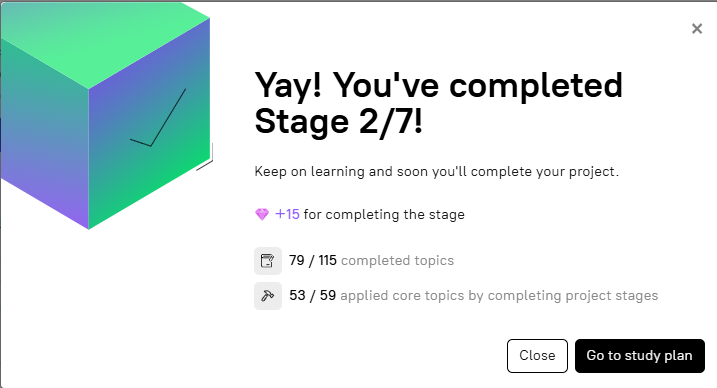

# stage-2-newtork-and-volume | [readme](../readme.md)

## [Stage 2/7:Network & volume](https://hyperskill.org/projects/374/stages/2232/implement)



### Network & volume

### Description
To be ready for further expansion with multiple services, it is common practice to define networks and volumes in [`docker-compose`](https://docs.docker.com/compose/), even if there is currently only one service. Let's modify the [`docker-compose.yaml`](https://docs.docker.com/compose/intro/compose-application-model/#the-compose-file) file by adding a network and a permanent volume for the service.

### Objectives
* Define the volume with the `mongo-data` name;
* Define the network with the `hyper-task-manager-network` name;
* Add the network to the `mongodb` service.
* Add the volume to the `mongodb` service and map it to the container's /_**data/db**_ directory.

### HINT by Jose Ernesto Pichardo Zavala
```
You can find many examples on google images, it will help you out a lot
Also quick reminder.
 
When defining both volumes and networks (not in the container) your line must start with the element itself and not any other symbol. The IDE might add a symbol at the start but it is wrong. example.
 
Right:
networks:
 <your_net>:
Wrong:
networks:
 - <your_net>:
```

### Links
* [Hyperskill: Docker-compose.yml syntax](https://hyperskill.org/learn/step/29898/)
* [Hyperskill Docker Network](https://hyperskill.org/learn/step/23960/)
* [docker compose yaml file](https://docs.docker.com/compose/intro/compose-application-model/#illustrative-example)
* [use a volume with docker compose](https://docs.docker.com/engine/storage/volumes/#use-a-volume-with-docker-compose)

### My Work
* see [docker-compose.yaml HERE](./docker-compose-files/stage-2-docker-compose/docker-compose.yaml) and [.env HERE](./docker-compose-files/stage-2-docker-compose/.env)


### Issues
* 12/9/2024:
```
Wrong answer in test #1 Value for the key `mongo-data` is wrong. It should be `None`
```

### Communications
* [Hyperskill discord: javapda DM to Ephantus Mwangi](https://discord.com/channels/@me/1315686310790565920/1315692744940851210) 12/6/2024 at 7:53am

@Ephantus Mwangi  nevermind, when I replaced the volumes/networks sections as shown below, the stage passes:
```
    volumes:
    mongo-data:
    networks:
    hyper-task-manager-network:
```

```
    version: "3.1"
    services:
    mongodb:
        image: mongo:6.0.8
        container_name: hyper-mongo
        environment:
        MONGO_INITDB_ROOT_USERNAME: ${MONGO_INITDB_ROOT_USERNAME}
        MONGO_INITDB_ROOT_PASSWORD: ${MONGO_INITDB_ROOT_PASSWORD}
        ports:
        - 27027:27017
        volumes:
        - mongo-data:/data/db
        networks:
        - hyper-task-manager-network
        env_file:
        - .env

    volumes:
    mongo-data:
    networks:
    hyper-task-manager-network:
```
* [Hyperskill discord: javapda DM to Ephantus Mwangi](https://discord.com/channels/@me/1315686310790565920/1315686317128159324) 12/9/2024 at 7:27am

On stage 2 of the Hyperskill Compose project Stage 2/7:Network & volume 

Getting the following error:

> Wrong answer in test #1 Value for the key `mongo-data` is wrong. It should be `None`


Not sure what they are looking for? It seems to be related to the volume mongo-data declaration in docker-compose.yaml which I have as:

```
version: '3.1'
name: hyper-mongo   # this is the name of the container made from docker compose up

services:
  mongodb:
    
    image: mongo:6.0.8
    container_name: hyper-mongo
    ports:
      - "27027:27017"
    env_file: ['.env']
    environment:
      MONGO_INITDB_ROOT_USERNAME: ${MONGO_INITDB_ROOT_USERNAME}
      MONGO_INITDB_ROOT_PASSWORD: ${MONGO_INITDB_ROOT_PASSWORD}
    networks:
      - hyper-task-manager-network
    volumes:
      - mongo-data:/data/db

volumes:
  mongo-data: {}

networks:
  hyper-task-manager-network: {}
```

Do you understand what they mean by:  `Value for the key mongo-data is wrong.`?