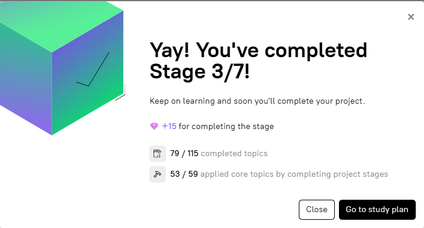

# stage-3-task-manager | [readme](../readme.md)

### [Stage 3/7:Task manager](https://hyperskill.org/projects/374/stages/2233/implement)



### Task manager

### Description
In this stage, integrate the main application as an additional service. To accomplish this, use the provided Dockerfile located in the project directory. Use the relevant command leveraging the Dockerfile to construct an image encompassing the main application. Subsequently, define the essential environment variables that your application will utilize. Please adhere to the following objectives to complete your assigned tasks.

### Objectives
* Add another service to the _**docker-compose.yaml**_ file with the attributes below;
    * Define the service with the `hyper-service` name;
    * Add the command to build the image for your service;
    * Define the container name with the `hyper-task-manager` value;
    * Define the `MONGO_INITDB_ROOT_USERNAME` environment variable with the `${MONGO_INITDB_ROOT_USERNAME}` value;
    * Define the `MONGO_INITDB_ROOT_PASSWORD` environment variable with the `${MONGO_INITDB_ROOT_PASSWORD}` value;
    * Define the `MONGO_HOST_NAME` environment variable with the `mongodb` value;
    * Define the `MONGO_PORT_NUMBER` environment variable with the `27017` value;
    * Define the `env_file` option for the .env file.


### HINT by Jose Ernesto Pichardo Zavala
```
for building the image youll need not only build: but also context: and dockerfile: google for more info
```

### [docker-compose.yaml for this problem](./docker-compose-files/stage-3-docker-compose/docker-compose.yaml)

### [Dockerfile from Hyperskill stage 3](./docker-compose-files/stage-3-docker-compose/Dockerfile)


### Resources
* docker-compose resources
    * [build](https://docs.docker.com/reference/compose-file/build/)
    * [build attributes](https://docs.docker.com/reference/compose-file/build/#attributes)