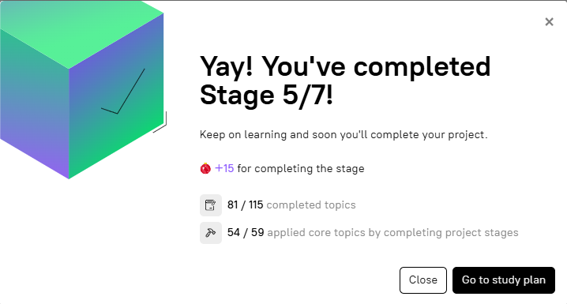

# stage-5-get-started | [readme](../readme.md)

### results
* 81/115 topics
* 54/59 project topics




### [Stage 5/7:Get started](https://hyperskill.org/projects/374/stages/2235/implement)


### Get started

### Description
Great job on accomplishing the assigned tasks! Now, let's initiate the services by executing the suitable docker-compose command. But before that, don't forget to create a .env file with secrets.

### Objectives
* Create a .env file in the project directory with the following content:
    * the `MONGO_INITDB_ROOT_USERNAME` key with the `admin` value;
    * the `MONGO_INITDB_ROOT_PASSWORD` key with the `84225adce`^/ value.
* Start the defined services in the `docker-compose.yaml` file.


### HINT by Hubert Michalec
```
If your container hyper-task-mangodb starts and stops working change the following:
MONGO_PORT_NUBMER:
as it has a typo which is not corrected for the time being.
```
> NOTE: this last piece, the type-o of `MONGO_PORT_NUBMER` is crucial

