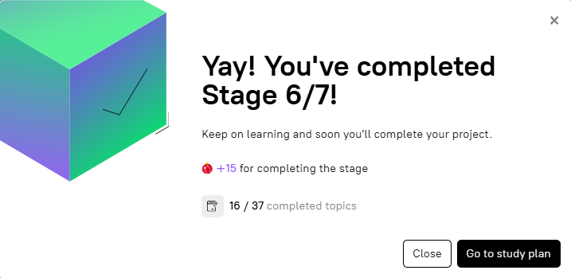

# stage-6-reboot | [readme](../readme.md)



### [Stage 6/7:Reboot](https://hyperskill.org/projects/374/stages/2236/implement)

### Reboot

### Description

Unfortunately, our naming convention has changed. For this reason, we need to modify our docker-compose.yml file to add these changes. Additionally, we need to rebuild our container and restart the services to ensure that these changes take effect. Read the API endpoints documentation in the project directory to educate yourself about the available endpoints for our application and their usage. Once ready, create your first task by requesting the appropriate endpoint based on the documentation.

> While restarting your services with the help of the `docker-compose`, use the correct option to rebuild your image.

### Objectives

* Modify the docker-compose.yml file and rename your resources with the following values:
    * Application container - rename it to `task-manager-app`;
    * Database container - rename it to `task-manager-db`;
    * Volume - give it the `task-manager-data` name;
    * Network - give it the `task-manager-network` name;
* Build and restart the services;
* Create a task with the title `Study` and the description `Study DevOps`.

### HINT by Razvan Odenie
```
If you get the following error: "Wrong answer in test #3 'task-manager-app' not found in the system images!"

You can try to rename the application container from "hyper-service" to "app". With the old name the application image would be created as "task-manager-hyper-service" which was not correct based on the test requirements.
```

### My Work
* we need to _**Create a task with the title Study and the description Study DevOps.**)
    * to do this we need to analyze the contents of the [`api_documentation.yaml`](./docker-compose-files/stage-5-docker-compose/api_documentation.md) file provided by the Hyperskill problem - specifically the section called `Create a task`
* before we can make the RESTful calls we need to start the compose network: `docker compose up` from the `C:\Users\someuser\PycharmProjects\Composer` folder

### Endpoints from [`api_documentation.yaml`](./docker-compose-files/stage-6-docker-compose/api_documentation.md)
* http://127.0.0.1:8000/tasks


### Create a task
[`api_documentation.yaml`](./docker-compose-files/stage-5-docker-compose/api_documentation.md) file documents the RESTful call needed to create a task via a bash curl command or a powershell `Invoke-RestMethod` invocation. We can also do it with [Postman](https://www.postman.com/).
```
POST http://localhost:8000/tasks

ContentType "application/json"

# the json body of the request:

  {"title":"Task title","description":"Task description"}
```

### Postman support | [POSTMAN scripts](https://bitbucket.org/kroubalkian/hyperskill-project-composer/src/main/docs/docker-compose-files/stage-5-docker-compose/postman/hyperskill-project-compose.postman_collection.json)
* create a collection in [Postman](https://www.postman.com/) called `hyperskill-project-compose`
* add a request to each of those endpoints documented in [`api_documentation.yaml`](./docker-compose-files/stage-5-docker-compose/api_documentation.md).
