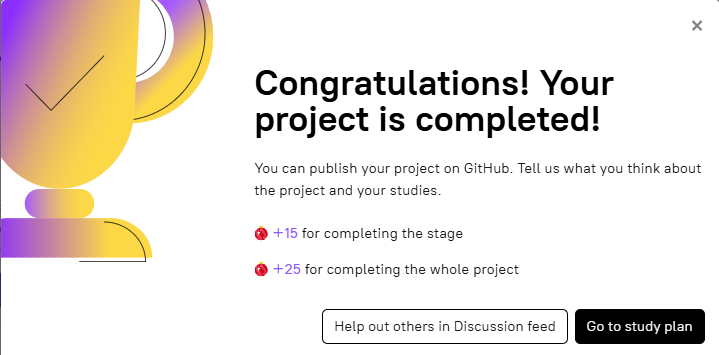

# stage-7-terminate | [readme](../readme.md)



### [Stage 7/7:Terminate](https://hyperskill.org/projects/374/stages/2237/implement)

### Terminate

### Description
An essential capability of the `docker-compose` tool is its ability to halt services effortlessly and remove all associated containers, volumes, and networks. Proceed to stop all the services and delete the containers, networks, and volumes defined in your `docker-compose` file.

> Use the commands that will delete your volumes cautiously and ensure that you have backed up any important data before running it.

> Once you have deleted a tagged image, you can employ the [`docker image prune`](https://docs.docker.com/reference/cli/docker/image/prune/) command to remove any dangling images. Exercise caution while using this command.

### Objectives
* Stop the services, delete containers, networks, and volumes;
* Remove the hyper-service image from the system.

### My Work

* [docker-compose.yaml](docker-compose-files/stage-7-docker-compose/docker-compose.yaml)
* [api_documentation](docker-compose-files/stage-7-docker-compose/api_documentation.md)
* http://127.0.0.1:8000/tasks
* run the following commands:
```

docker compose stop
# use CAUTION with prune, will remove ALL
docker image prune -a
docker volume prune -a
docker network rm hyper-mongo_task-manager-network
```